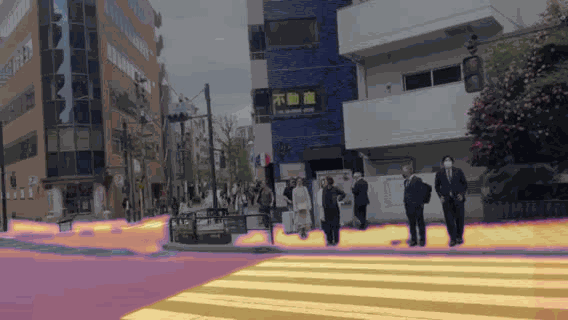
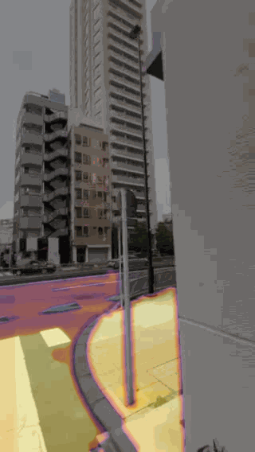

# Street-Walkability-Evaluation
A computational framework for street walkability assessment using street-view imagery, semantic features, spatial geometry, dynamic disturbances, and temporal stability to build a continuous WalkAbility heat surface and multidimensional evaluation indicators.

---

## Overview

This repository provides a methodological framework for evaluating **street walkability** from street-view imagery and related geospatial data.

The core idea is to extract and integrate:

- **Semantic information** from street-view images
- **Spatial geometric features** of street environments
- **Dynamic disturbances** caused by moving objects and transient activities
- **Temporal stability** across different observation times

These components are combined to construct a continuous **WalkAbility heat surface**, followed by the development of **WalkAbility indicators** that quantify walkability performance from multiple dimensions.

---

### Walkability Result Examples

The following GIFs show example results of the walkability analysis.





These examples illustrate the visualized outputs of the WalkAbility evaluation results.

---

## Methodology

### 1. Semantic Feature Extraction
Street-view imagery is processed to extract semantic elements related to walkability, such as:

- Sidewalks
- Trees and greenery
- Building frontage
- Sky visibility
- Vehicles
- Pedestrians

### 2. Spatial Geometric Analysis
Geometric properties of the street environment are quantified, including:

- Street enclosure
- Visual openness
- Width-to-height ratio
- View continuity
- Edge definition
- Spatial permeability

### 3. Dynamic Disturbance Modeling
Transient or moving elements that may reduce walking comfort are identified and modeled, such as:

- Motor vehicles
- Traffic congestion
- Crowding
- Construction disturbance
- Temporary obstructions

### 4. Temporal Stability Assessment
Street conditions are compared across time to measure how stable or variable the walkability environment is.

### 5. WalkAbility Heat Surface Construction
A continuous heat surface is generated by integrating the extracted features and spatializing the walkability score across street segments or urban space.

### 6. WalkAbility Indicator System
A multidimensional indicator system is developed to evaluate walkability performance, for example:

- Visual comfort
- Accessibility support
- Environmental quality
- Dynamic interference
- Temporal consistency
- Overall WalkAbility score

---

## Workflow

```text
Street-view images + Geospatial data
                |
                v
     Semantic feature extraction
                |
                v
    Spatial geometry quantification
                |
                v
     Dynamic disturbance detection
                |
                v
      Temporal stability analysis
                |
                v
   WalkAbility score integration model
                |
                v
 Continuous WalkAbility heat surface
                |
                v
 Multidimensional WalkAbility indicators
